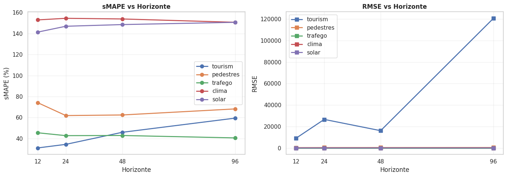
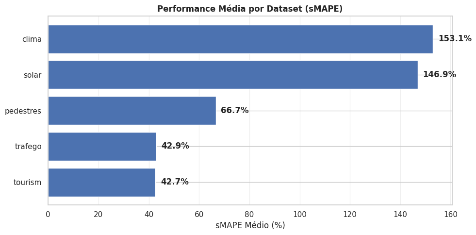
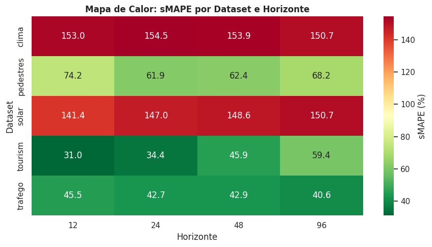

# Time Series Benchmark - PatchTST on Multiple Datasets

## Description

This project implements a **comprehensive benchmark** to evaluate the performance of the **PatchTST** model (Patch Time Series Transformer) on multiple time series datasets and different forecasting horizons.

## 📊 Results and Demonstration

The benchmark evaluated the performance of PatchTST on 5 distinct datasets (Weather, Pedestrians, Solar, Tourism, and Traffic) with horizons from 12 to 96 steps.

### Average Performance by Dataset (sMAPE %)

| Dataset | Average sMAPE |
| :--- | :---: |
| **Weather** | 153.1% |
| **Solar** | 146.9% |
| **Pedestrians** | 66.7% |
| **Traffic** | 42.9% |
| **Tourism** | 42.7% |

### Visual Analysis of the Benchmark
Below, the graphs show the evolution of the error (RMSE and sMAPE) as the forecasting horizon increases.

### Heatmap (sMAPE by Horizon)
The heatmap allows for the identification of which datasets and horizons the PatchTST model exhibits the most stability.

---

## Context

PatchTST is a state-of-the-art Transformer architecture for time series forecasting. This project was developed as part of the **MEISSA** training program (LIAD/HP), exploring state-of-the-art forecasting techniques.

## Technologies Used

- **Python 3.x**
- **PyTorch** - Deep Learning Framework
- **Transformers (Hugging Face)** - PatchTST Implementation
- **Pandas & Matplotlib** - Data manipulation and visualization

## Methodology

1. **Architecture**: Patch-based approach with self-attention.
2. **Datasets**: 5 diverse datasets from the Monash Time Series Repository.
3. **Benchmark**: Systematic testing on horizons of [12, 24, 48, 96] steps.

## How to Run

Click the "Open in Colab" badge at the top of this README to run the notebook directly in your browser.

## Author

**Luiz Anselmo Medeiros Lima**
- GitHub: [@luizmlima](https://github.com/luizmlima)
- LinkedIn: [Luiz Anselmo Lima](https://www.linkedin.com/in/luiz-anselmo-lima)

## MEISSA Project

This project was developed as part of the **MEISSA** training program, a partnership between the **Laboratório de Inteligência Artificial e Arquiteturas Dedicadas (LIAD)** and **HP**.
